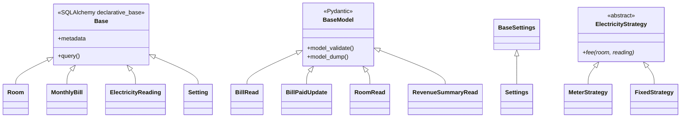
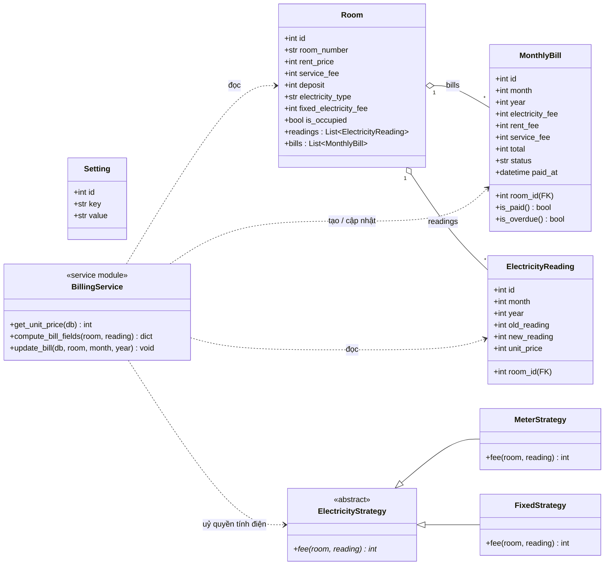

# Phân Tích Hướng Đối Tượng (OOP) — RentFlow

> Tài liệu phân tích cách bốn nguyên lý OOP và một số mẫu thiết kế (design pattern)
> được áp dụng trong **RentFlow** — ứng dụng quản lý nhà trọ một quản trị viên,
> xây dựng bằng **Python 3.11 + FastAPI + SQLAlchemy 2.0 + Pydantic v2**.
>
> Khác với một ứng dụng "OOP thuần" (mọi hành vi nằm trong phương thức của lớp),
> RentFlow theo kiến trúc **phân tầng + service**: dữ liệu nằm trong các lớp model,
> còn nghiệp vụ nằm trong tầng service. Tài liệu này phân tích **trung thực** chỗ nào
> OOP mạnh, chỗ nào là thủ tục (procedural) theo chủ đích, và đề xuất cải tiến.

---

## Mục lục

1. [Tổng quan các lớp trong hệ thống](#1-tổng-quan-các-lớp-trong-hệ-thống)
2. [Tính kế thừa (Inheritance)](#2-tính-kế-thừa-inheritance)
3. [Tính đóng gói (Encapsulation)](#3-tính-đóng-gói-encapsulation)
4. [Tính trừu tượng (Abstraction)](#4-tính-trừu-tượng-abstraction)
5. [Tính đa hình (Polymorphism)](#5-tính-đa-hình-polymorphism)
6. [Các mẫu thiết kế (Design Patterns)](#6-các-mẫu-thiết-kế-design-patterns)
7. [Sơ đồ lớp tổng hợp (UML Class Diagram)](#7-sơ-đồ-lớp-tổng-hợp-uml-class-diagram)
8. [Bảng tổng kết & đánh giá trung thực](#8-bảng-tổng-kết--đánh-giá-trung-thực)

---

## 1. Tổng quan các lớp trong hệ thống

RentFlow có ba nhóm lớp chính, mỗi nhóm kế thừa từ một lớp cơ sở của framework:

| Nhóm | Lớp cơ sở | Các lớp con | File |
|------|-----------|-------------|------|
| **Model (ORM)** | `Base` (SQLAlchemy `declarative_base`) | `Room`, `MonthlyBill`, `ElectricityReading`, `Setting` | `app/models/*.py` |
| **Schema (DTO)** | `pydantic.BaseModel` | `BillRead`, `BillPaidUpdate`, `RoomRead`, `RevenueSummaryRead`, ... | `app/schemas/*.py` |
| **Cấu hình** | `pydantic_settings.BaseSettings` | `Settings` | `app/core/config.py` |

Ba nhóm này phân tách rõ trách nhiệm:
- **Model** = trạng thái lưu xuống database (bảng SQL).
- **Schema** = "hợp đồng" dữ liệu đi vào/ra qua HTTP (validate + serialize).
- **Settings** = cấu hình runtime đọc từ biến môi trường / `.env`.

---

## 2. Tính kế thừa (Inheritance)

Đây là nơi OOP của RentFlow **mạnh và rõ ràng nhất** — kế thừa từ framework.

### 2.1. Model kế thừa `Base`

```python
# app/models/room.py
from app.db import Base

class Room(Base):
    __tablename__ = "rooms"
    id = Column(Integer, primary_key=True, index=True)
    room_number = Column(String, unique=True, index=True)
    rent_price = Column(Integer, default=0)
    ...
    readings = relationship("ElectricityReading", back_populates="room")
    bills = relationship("MonthlyBill", back_populates="room")
```

Khi `Room` kế thừa `Base`, nó **tự động nhận được**:
- Cơ chế ánh xạ thuộc tính ↔ cột (`Column`) qua metaclass của SQLAlchemy.
- Khả năng truy vấn (`db.query(Room)...`), thêm/xoá/cập nhật bản ghi.
- Đăng ký bảng vào `Base.metadata` để `create_all()` tạo schema.

Cả 4 model (`Room`, `MonthlyBill`, `ElectricityReading`, `Setting`) đều kế thừa
**cùng một** `Base`, nhờ đó chúng chia sẻ chung một `MetaData` và có thể liên kết
với nhau qua khoá ngoại (`ForeignKey`) + `relationship`.

### 2.2. Schema kế thừa `BaseModel`

```python
# app/schemas/bill.py
class BillPaidUpdate(BaseModel):
    room_id: int = Field(ge=1)
    month: int = Field(ge=1, le=12)
    year: int = Field(ge=2000, le=2100)
```

Kế thừa `BaseModel` mang lại miễn phí: kiểm tra kiểu, ràng buộc giá trị
(`ge`, `le`), sinh JSON Schema cho tài liệu `/docs`, và serialize/deserialize.

### 2.3. Quan hệ kế thừa (sơ đồ)



> **Ghi chú học thuật:** phần lớn kế thừa ở trên là **kế thừa từ framework**
> (framework inheritance). Ngoài ra RentFlow còn có **một cây kế thừa nghiệp vụ của
> riêng mình**: `MeterStrategy` và `FixedStrategy` kế thừa lớp trừu tượng
> `ElectricityStrategy` — xem [mục 5.3](#53-đa-hình-subtype-qua-mẫu-strategy-tính-tiền-điện--đã-hiện-thực).

---

## 3. Tính đóng gói (Encapsulation)

Đóng gói = giấu chi tiết bên trong, chỉ lộ ra giao diện cần thiết.

### 3.1. Đóng gói cấu hình + thành viên "riêng tư"

Python không có `private` cứng như Java/Swift, mà dùng **quy ước tiền tố `_`**.
`Settings` đóng gói logic lấy `SECRET_KEY` vào một hàm trợ giúp ngầm:

```python
# app/core/config.py
def _get_or_create_secret_key() -> str:   # '_' = nội bộ, không export
    env_key = os.getenv("SECRET_KEY")
    if env_key:
        return env_key
    ...

class Settings(BaseSettings):
    SECRET_KEY: str = _get_or_create_secret_key()

    @model_validator(mode="after")
    def _resolve_database_url(self):       # '_' = hook nội bộ
        if self.DATABASE_URL and self.DATABASE_URL.startswith("postgres://"):
            self.SQLALCHEMY_DATABASE_URL = self.DATABASE_URL.replace(
                "postgres://", "postgresql://", 1)
        return self
```

Nơi gọi chỉ dùng `settings.SECRET_KEY` — **không cần biết** key đến từ env, từ
`.env`, hay được sinh mới. Toàn bộ độ phức tạp được **giấu kín**.

### 3.2. Đóng gói nghiệp vụ trong tầng service

Hàm `update_bill()` đóng gói **toàn bộ** quy tắc tính hoá đơn + quy tắc
"không ghi đè hoá đơn đã thu". Endpoint chỉ gọi một dòng, không thấy SQL bên trong:

```python
# app/services/billing.py
def update_bill(db, room, month, year):
    ...
    if bill:
        if bill.status == "unpaid":   # quy tắc nghiệp vụ được giấu ở đây
            bill.total = fields["total"]
            ...
    db.commit()
```

### 3.3. Đóng gói vòng đời tài nguyên

`get_db()` giấu việc mở/đóng `Session` sau generator — nơi dùng chỉ khai báo
`db: Session = Depends(get_db)` mà không bao giờ phải tự đóng kết nối.

### 3.4. Hành vi trong model — `is_paid` / `is_overdue` ✅ đã hiện thực

Quy tắc "thế nào là đã thu / còn nợ" được đóng gói **trong chính** `MonthlyBill`,
thay vì rải `status == "unpaid"` khắp endpoint và service:

```python
# app/models/monthly_bill.py
class MonthlyBill(Base):
    ...
    PAID_STATUSES = ("paid", "prepaid")

    @property
    def is_paid(self) -> bool:
        return self.status in self.PAID_STATUSES

    @property
    def is_overdue(self) -> bool:
        return not self.is_paid
```

`update_bill` nay dùng `if bill.is_overdue:` thay cho so sánh chuỗi — nơi gọi không
cần biết "unpaid" là giá trị gì, chỉ hỏi đối tượng "còn nợ không?". Hành vi được khoá
bởi `tests/test_model_behavior.py` (5 ca).

> **Đánh giá trung thực:** phần lớn nghiệp vụ nặng (tính tiền, ghi DB) vẫn ở tầng
> service — đây là lựa chọn kiến trúc phổ biến và hợp lý trong web Python. Nhưng các
> quy tắc trạng thái thuần (đã thu / còn nợ) đã được đưa **vào model**, giảm rõ rệt
> tình trạng *anemic* và tăng tính đóng gói.

---

## 4. Tính trừu tượng (Abstraction)

Trừu tượng = làm việc với khái niệm ở mức cao, ẩn đi cách hiện thực.

### 4.1. Schema như một "hợp đồng" (interface dữ liệu)

`BillRead` định nghĩa **hình dạng** của một hoá đơn khi trả về client mà không
ràng buộc vào cấu trúc bảng SQL bên trong:

```python
class BillRead(BaseModel):
    room_id: int
    room_number: str          # ghép từ Room, không có trong bảng monthly_bills
    total: int
    status: str
    is_fixed: bool            # suy ra từ Room.electricity_type
    ...
```

Frontend chỉ phụ thuộc vào hợp đồng này; tầng dưới đổi cách lưu trữ vẫn không sao.

### 4.2. Dependency Injection — trừu tượng hoá sự phụ thuộc

FastAPI cho phép khai báo "tôi cần một `Session`" thay vì tự tạo:

```python
@router.get("/")
async def get_bills(month: int, year: int, db: Session = Depends(get_db)):
    return _collect_bills(db, month, year)
```

Handler **không biết** `db` được tạo thế nào — đó là trừu tượng hoá phụ thuộc.
Khi test, ta tráo `get_db` bằng session SQLite trong bộ nhớ mà không sửa handler
(xem `tests/conftest.py`).

### 4.3. Hàm thuần `compute_bill_fields` — trừu tượng nghiệp vụ

```python
def compute_bill_fields(room, reading) -> dict:
    """Tính tiền cho 1 phòng/tháng — THUẦN, KHÔNG đụng DB."""
```

Hàm này trừu tượng hoá "công thức tính tiền" thành một đơn vị **thuần khiết**
(pure), dùng lại được cho cả luồng ĐỌC (hiển thị) lẫn GHI (`update_bill`).

---

## 5. Tính đa hình (Polymorphism)

RentFlow thể hiện đa hình ở ba mức: ghi đè phương thức, đa hình tham số (generics),
và — rõ nhất — **đa hình subtype qua mẫu Strategy** cho việc tính tiền điện
(`app/services/electricity_strategy.py`).

### 5.1. Đa hình qua ghi đè phương thức (method overriding)

`Settings` ghi đè hành vi khởi tạo của `BaseSettings` bằng một validator riêng:

```python
@model_validator(mode="after")
def _resolve_database_url(self): ...
```

Pydantic gọi validator này một cách **đa hình**: nó không biết lớp con sẽ định
nghĩa logic gì, chỉ biết "sau khi tạo xong thì gọi các validator `mode="after"`".

### 5.2. Đa hình tham số (parametric polymorphism) qua Generics

`relationship("ElectricityReading", back_populates="room")` và truy vấn
`db.query(T)` hoạt động **đồng nhất** với mọi lớp con của `Base` — một cơ chế,
nhiều kiểu. Đây là đa hình kiểu tham số do SQLAlchemy cung cấp.

### 5.3. Đa hình subtype qua mẫu Strategy (tính tiền điện) ✅ đã hiện thực

Trước đây việc chọn cách tính tiền điện dựa trên **rẽ nhánh `if/elif`** theo
`electricity_type` — không phải đa hình thật. Nay đã refactor thành **mẫu Strategy**:
mỗi loại điện là một lớp con của lớp trừu tượng `ElectricityStrategy`, cùng ghi đè
phương thức `fee()`:

```python
# app/services/electricity_strategy.py
class ElectricityStrategy(ABC):
    @abstractmethod
    def fee(self, room, reading) -> int: ...

class MeterStrategy(ElectricityStrategy):       # tính theo số điện
    def fee(self, room, reading) -> int:
        if not reading:
            return 0
        return (reading.new_reading - reading.old_reading) * reading.unit_price

class FixedStrategy(ElectricityStrategy):       # khoán, bỏ qua chỉ số
    def fee(self, room, reading) -> int:
        return room.fixed_electricity_fee or 0

_STRATEGIES = {"meter": MeterStrategy(), "fixed": FixedStrategy()}

def electricity_fee(room, reading) -> int:
    return _STRATEGIES.get(room.electricity_type, _STRATEGIES["meter"]).fee(room, reading)
```

Tại nơi gọi (`compute_bill_fields`) **không còn `if/elif`** — chỉ một lời gọi đa hình:

```python
# app/services/billing.py
def compute_bill_fields(room, reading) -> dict:
    elec_fee = electricity_fee(room, reading)   # đa hình: gọi đúng strategy theo type
    return {"electricity_fee": elec_fee, "rent_fee": room.rent_price, ...}
```

> **Vì sao đây là đa hình subtype thật:** `electricity_fee` không biết (và không cần
> biết) phòng thuộc loại nào — nó gọi `fee()` trên một đối tượng `ElectricityStrategy`,
> và **phiên bản phương thức được chọn lúc chạy** theo kiểu thực của đối tượng. Thêm
> loại điện mới = thêm một lớp `XxxStrategy` + đăng ký vào `_STRATEGIES`, **không sửa**
> hàm tính tiền (tuân thủ Open/Closed Principle). Hành vi được khoá bởi
> `tests/test_electricity_strategy.py` (6 ca).

---

## 6. Các mẫu thiết kế (Design Patterns)

RentFlow dùng vài mẫu thiết kế phổ biến của hệ sinh thái Python/FastAPI:

| Mẫu | Vai trò trong RentFlow | Nơi xuất hiện |
|-----|------------------------|----------------|
| **Strategy** | Mỗi loại điện một thuật toán tính tiền (`fee()`), chọn lúc chạy | `app/services/electricity_strategy.py` |
| **Dependency Injection** | Bơm `Session` (và trước đây là `current_user`) vào handler | `Depends(get_db)` ở mọi endpoint |
| **Service Layer** | Tách nghiệp vụ tính tiền khỏi tầng HTTP | `app/services/billing.py` |
| **Factory** | `SessionLocal = sessionmaker(...)` sinh ra các session mới | `app/db/session.py` |
| **Singleton (module-level)** | `settings`, `Base`, `engine` chỉ tồn tại một bản trong tiến trình | `config.py`, `db/` |
| **Generator / RAII** | `get_db()` mở–`yield`–đóng session an toàn | `app/api/deps.py` |
| **DTO (Data Transfer Object)** | Pydantic schema chuyển dữ liệu giữa các tầng | `app/schemas/*` |

> So với app tham chiếu (dùng `Manager.shared` làm Singleton tường minh kiểu OOP),
> RentFlow đạt hiệu ứng "một thực thể duy nhất" bằng **biến cấp module** — cách làm
> đặc trưng và idiomatic của Python, không cần lớp Singleton thủ công.

---

## 7. Sơ đồ lớp tổng hợp (UML Class Diagram)



---

## 8. Bảng tổng kết & đánh giá trung thực

### 8.1. Bốn nguyên lý OOP trong RentFlow

| Nguyên lý | Mức độ | Thể hiện rõ nhất | Vị trí |
|-----------|:------:|------------------|--------|
| **Kế thừa** | 🟢 Mạnh | Model ← `Base`, Schema ← `BaseModel`, `Settings` ← `BaseSettings`; `MeterStrategy`/`FixedStrategy` ← `ElectricityStrategy` (ABC) | `models/`, `schemas/`, `config.py`, `electricity_strategy.py` |
| **Trừu tượng** | 🟢 Mạnh | Schema-hợp đồng, Dependency Injection, lớp trừu tượng `ElectricityStrategy(ABC)` | `schemas/`, `deps.py`, `electricity_strategy.py` |
| **Đóng gói** | 🟢 Mạnh | Service giấu nghiệp vụ; `_`-helper trong `Settings`; hành vi `is_paid`/`is_overdue` trong model | `billing.py`, `config.py`, `monthly_bill.py` |
| **Đa hình** | 🟢 Mạnh | Strategy `fee()` chọn lúc chạy theo loại điện; ghi đè validator; generics ORM | `electricity_strategy.py`, `config.py` |

### 8.2. Hai cải tiến OOP đã hiện thực ✅

Hai thay đổi dưới đây đã được đưa vào code (có test, không phá kiến trúc cũ), biến
hai ô từng yếu (Đóng gói, Đa hình) thành mạnh:

| Cải tiến | Trụ cột OOP minh hoạ | File | Test |
|----------|----------------------|------|------|
| **(a) Strategy Pattern** cho tính tiền điện (`ElectricityStrategy` ABC + `MeterStrategy`/`FixedStrategy`) | Đa hình subtype · Trừu tượng (ABC) · Kế thừa · mẫu Strategy · OCP | `app/services/electricity_strategy.py` · `app/services/billing.py` | `tests/test_electricity_strategy.py` (6) |
| **(b) Hành vi cho model** (`is_paid` / `is_overdue` trên `MonthlyBill`) | Đóng gói (chống *anemic*) | `app/models/monthly_bill.py` · `app/services/billing.py` | `tests/test_model_behavior.py` (5) |

Chi tiết mã đã trình bày ở [mục 5.3](#53-đa-hình-subtype-qua-mẫu-strategy-tính-tiền-điện--đã-hiện-thực)
(Strategy) và [mục 3.4](#34-hành-vi-trong-model--is_paid--is_overdue--đã-hiện-thực)
(hành vi model). Cả hai giữ nguyên hành vi nghiệp vụ — bộ test cũ
(`tests/test_billing.py`) đóng vai lưới an toàn hồi quy.

### 8.3. Hướng mở rộng tiếp theo (chưa làm)

- Gộp logic tạo bill còn lặp ở `mark-prepaid` và `import-csv` về dùng chung
  `electricity_fee()` / một hàm khởi tạo bill duy nhất.
- Thu hẹp `except Exception` trong `import-csv` và bổ sung test cho các endpoint
  ghi hàng loạt (xem `Testing_Report.md`).

---

*RentFlow — Phân tích OOP. Tài liệu phục vụ học phần Lập trình Hướng Đối Tượng.*
