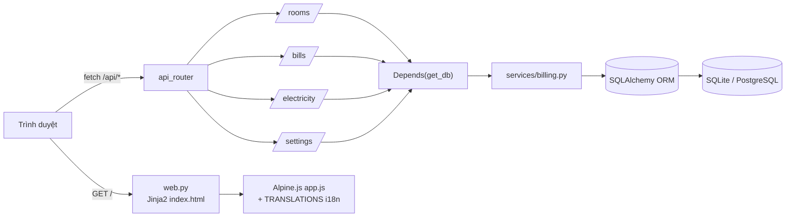
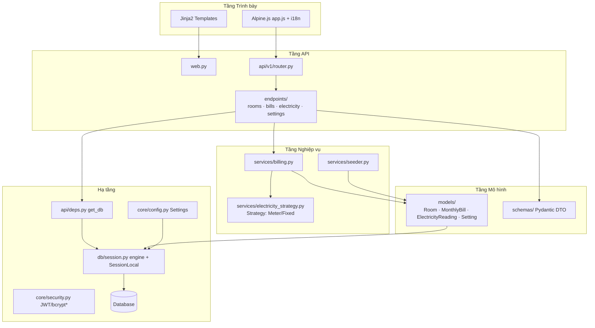
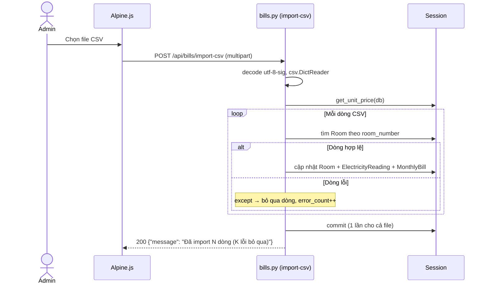
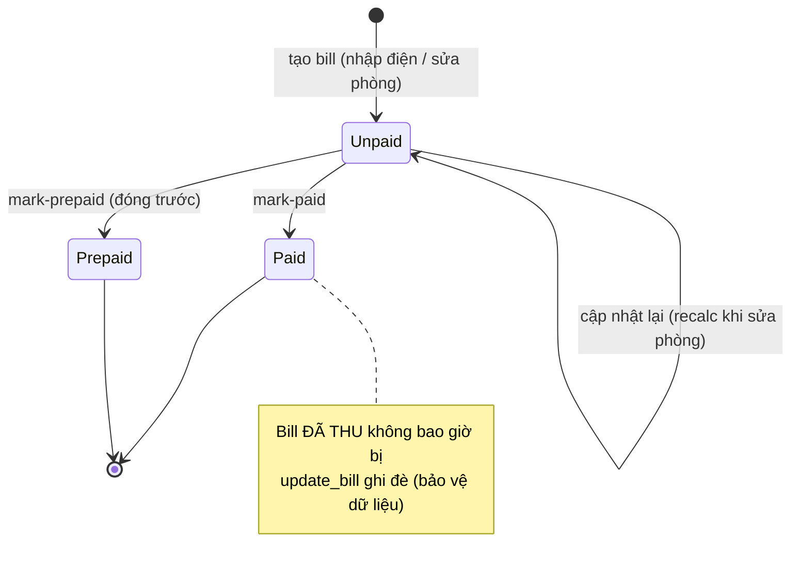
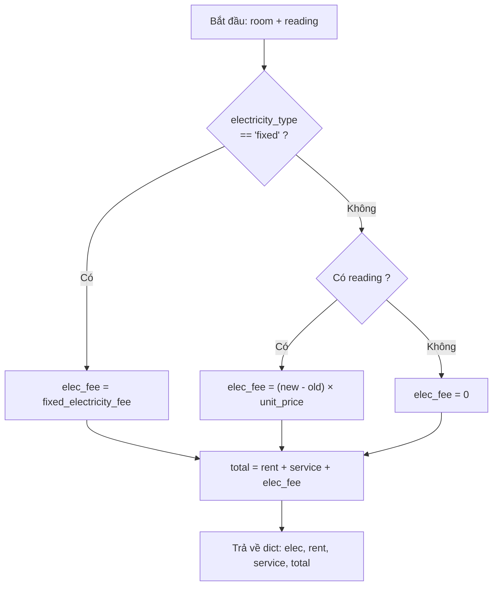

# Kiến Trúc & Sơ Đồ UML — RentFlow

> Mô tả kiến trúc phân tầng của **RentFlow** kèm các sơ đồ UML: Use Case, Component,
> Sequence, State, Activity và sơ đồ luồng request. Tất cả vẽ bằng **Mermaid** để
> hiển thị trực tiếp trên GitHub.
>
> **Stack:** Python 3.11 · FastAPI · SQLAlchemy 2.0 · Pydantic v2 · Jinja2 + Alpine.js ·
> SQLite (dev) / PostgreSQL (prod, Vercel).

---

## Mục lục

1. [Sơ đồ luồng request (Request Flow)](#1-sơ-đồ-luồng-request-request-flow)
2. [Sơ đồ Use Case](#2-sơ-đồ-use-case)
3. [Sơ đồ Component (kiến trúc phân tầng)](#3-sơ-đồ-component-kiến-trúc-phân-tầng)
4. [Sơ đồ Sequence — Đánh dấu đã thu (mark-paid)](#4-sơ-đồ-sequence--đánh-dấu-đã-thu-mark-paid)
5. [Sơ đồ Sequence — Import CSV](#5-sơ-đồ-sequence--import-csv)
6. [Sơ đồ State — Vòng đời hoá đơn](#6-sơ-đồ-state--vòng-đời-hoá-đơn)
7. [Sơ đồ Activity — Tính tiền một phòng](#7-sơ-đồ-activity--tính-tiền-một-phòng)
8. [Bảng endpoint API](#8-bảng-endpoint-api)

---

## 1. Sơ đồ luồng request (Request Flow)



Hai cổng vào tách biệt:
- **`web.py`** phục vụ trang HTML (server-rendered Jinja2). Giao diện động do
  **một** component Alpine `app()` trong `app/static/js/app.js` điều khiển.
- **`api_router`** phục vụ REST JSON cho frontend gọi qua `fetch()`.

> **Lưu ý phiên bản:** dự án hiện ở chế độ **mở** (commit *"Remove login/auth: open
> project with sample data"*). Mọi endpoint công khai, không cần JWT. Mã xác thực
> (`app/core/security.py`: JWT + bcrypt) vẫn còn trong repo và có thể bật lại.

---

## 2. Sơ đồ Use Case

```mermaid
flowchart TB
    Admin([👤 Quản trị viên])

    subgraph Phòng
        UC1[Xem danh sách phòng]
        UC2[Thêm / xoá phòng]
        UC3[Cập nhật thông tin phòng]
        UC4[Trả phòng / chuyển ra]
        UC5[Xem lịch sử phòng]
    end

    subgraph HoaDon[Hoá đơn & Doanh thu]
        UC6[Xem hoá đơn theo tháng]
        UC7[Đánh dấu đã thu]
        UC8[Đóng trước nhiều tháng]
        UC9[Xem công nợ phải thu]
        UC10[Xem tổng doanh thu]
        UC11[Xuất CSV / Import CSV]
    end

    subgraph Dien[Điện & Cài đặt]
        UC12[Nhập chỉ số điện]
        UC13[Cấu hình giá điện, ngân hàng]
        UC14[Tạo mã VietQR thu tiền]
    end

    Admin --> UC1 & UC2 & UC3 & UC4 & UC5
    Admin --> UC6 & UC7 & UC8 & UC9 & UC10 & UC11
    Admin --> UC12 & UC13 & UC14
```



---

## 3. Sơ đồ Component (kiến trúc phân tầng)



\* `security.py` còn trong repo nhưng không gắn vào route ở chế độ mở hiện tại.

---

## 4. Sơ đồ Sequence — Đánh dấu đã thu (mark-paid)

```mermaid
sequenceDiagram
    actor Admin
    participant JS as Alpine.js
    participant EP as bills.py (mark-paid)
    participant DB as Session (get_db)
    participant SVC as billing.update_bill

    Admin->>JS: Bấm "Đã thu" cho phòng X tháng M
    JS->>EP: POST /api/bills/mark-paid {room_id, month, year}
    Note over EP: Pydantic validate BillPaidUpdate<br/>(month 1–12, year 2000–2100)
    EP->>DB: query MonthlyBill(room, month, year)
    alt Chưa có hoá đơn
        EP->>SVC: update_bill(db, room, month, year)
        SVC->>DB: tạo MonthlyBill (status="unpaid") + commit
        EP->>DB: query lại MonthlyBill
    end
    EP->>DB: bill.status = "paid"; bill.paid_at = now(); commit
    EP-->>JS: 200 {"message": "Đã đánh dấu thanh toán"}
    JS-->>Admin: Cập nhật badge trạng thái
```

---

## 5. Sơ đồ Sequence — Import CSV



> Một dòng bẩn không làm hỏng cả lần import — đây là điểm mạnh về độ bền,
> nhưng `except Exception` quá rộng cũng là điểm yếu (xem `Testing_Report.md`).

---

## 6. Sơ đồ State — Vòng đời hoá đơn



Quy tắc cốt lõi: `update_bill()` **chỉ** cập nhật khi `status == "unpaid"`. Hoá đơn
`paid`/`prepaid` là bất biến trước mọi lần tính lại — bảo vệ lịch sử thu tiền.

---

## 7. Sơ đồ Activity — Tính tiền một phòng (`compute_bill_fields`)



> Trong code, hai nhánh `fixed` / `meter` không nằm trong một khối `if/elif` nữa mà
> được tách thành `FixedStrategy.fee()` và `MeterStrategy.fee()` (**mẫu Strategy** —
> xem `OOP_Analysis.md` mục 5.3). `compute_bill_fields` chỉ gọi `electricity_fee(room,
> reading)` và để đa hình chọn đúng nhánh lúc chạy.

---

## 8. Bảng endpoint API

| Method | Đường dẫn | Chức năng |
|--------|-----------|-----------|
| GET | `/api/rooms/` | Danh sách phòng |
| POST | `/api/rooms/` | Thêm phòng |
| DELETE | `/api/rooms/{id}` | Xoá phòng |
| POST | `/api/rooms/update` | Cập nhật phòng |
| POST | `/api/rooms/{id}/move-out` | Trả phòng |
| GET | `/api/rooms/{id}/history` | Lịch sử phòng |
| GET | `/api/bills/` | Hoá đơn theo tháng |
| GET | `/api/bills/receivables` | Công nợ phải thu |
| GET | `/api/bills/revenue/summary` | Tổng doanh thu theo kỳ |
| GET | `/api/bills/export` | Xuất CSV |
| POST | `/api/bills/mark-paid` | Đánh dấu đã thu |
| POST | `/api/bills/mark-prepaid` | Đóng trước nhiều tháng |
| POST | `/api/bills/import-csv` | Import CSV |
| POST | `/api/electricity/` | Nhập chỉ số điện |
| GET | `/api/settings/` | Đọc cài đặt |
| POST | `/api/settings/` | Lưu cài đặt |

---

*RentFlow — Tài liệu Kiến trúc & UML. Học phần Lập trình Hướng Đối Tượng.*
