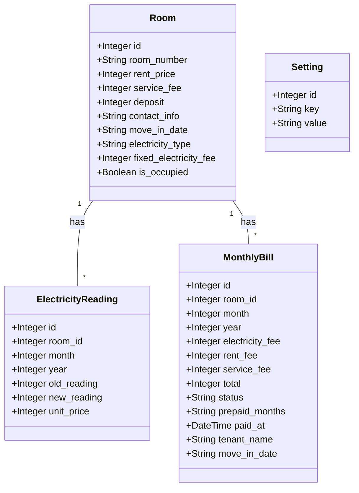
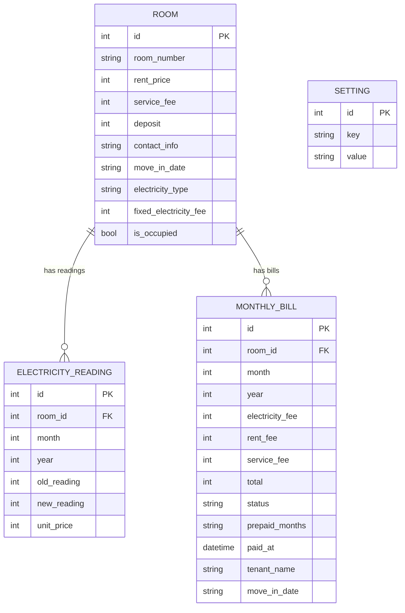

# Project UML Diagrams

## Class Diagram

```mermaid
classDiagram
    class Room {
        +Integer id
        +String room_number
        +Integer rent_price
        +Integer service_fee
        +Integer deposit
        +String contact_info
        +String move_in_date
        +String electricity_type
        +Integer fixed_electricity_fee
        +Boolean is_occupied
    }

    class ElectricityReading {
        +Integer id
        +Integer room_id
        +Integer month
        +Integer year
        +Integer old_reading
        +Integer new_reading
        +Integer unit_price
    }

    class MonthlyBill {
        +Integer id
        +Integer room_id
        +Integer month
        +Integer year
        +Integer electricity_fee
        +Integer rent_fee
        +Integer service_fee
        +Integer total
        +String status
        +String prepaid_months
        +DateTime paid_at
        +String tenant_name
        +String move_in_date
    }

    class Setting {
        +Integer id
        +String key
        +String value
    }

    Room "1" -- "*" ElectricityReading : has
    Room "1" -- "*" MonthlyBill : has
```

## Entity Relationship Diagram (ERD)

```mermaid
erDiagram
    ROOM ||--o{ ELECTRICITY_READING : "has readings"
    ROOM ||--o{ MONTHLY_BILL : "has bills"
    
    ROOM {
        int id PK
        string room_number
        int rent_price
        int service_fee
        int deposit
        string contact_info
        string move_in_date
        string electricity_type
        int fixed_electricity_fee
        bool is_occupied
    }

    ELECTRICITY_READING {
        int id PK
        int room_id FK
        int month
        int year
        int old_reading
        int new_reading
        int unit_price
    }

    MONTHLY_BILL {
        int id PK
        int room_id FK
        int month
        int year
        int electricity_fee
        int rent_fee
        int service_fee
        int total
        string status
        string prepaid_months
        datetime paid_at
        string tenant_name
        string move_in_date
    }

    SETTING {
        int id PK
        string key
        string value
    }
```
